# FPGA から Arduino 用の LCD シールドを制御する

[Arduino 用の LCD シールド](https://www.amazon.co.jp/gp/product/B06Y5ZXXL8/ref=oh_aui_detailpage_o01_s00?ie=UTF8&psc=1) が CORA にちょうど良い大きさなので活用します。  
しかし、GPIO を使うととっても遅いので、フレームバッファから読みだしたデータを LCD に転送する IP を作りました。

こんな感じ



BusControl は frame_req を受けると 1フレーム分のデータを AXI マスタから読みだす。  
1回のリクエストは 32bit×20バースト。  
ただし、fifo_full 期間中は休む。

Fifo は AXI マスタからの読み出しデータを積む。  
1バースト分の空きがなくなると、fifo_full をあげる。  
fifo にデータがある間は fifo_valid をあげる。  
fifo_req で次の 1データを読み出す。

Reg は fifo_valid があがると 40サイクルかけて 8bit のデータを 4回(=32bit)出力する。  
データを出力し終わると fifo_req をあげる。

Reg には GPIO 機能もあるので、細かい制御には GPIO を使う。

使い方は ```ex5_2.c``` を参考にしてください。